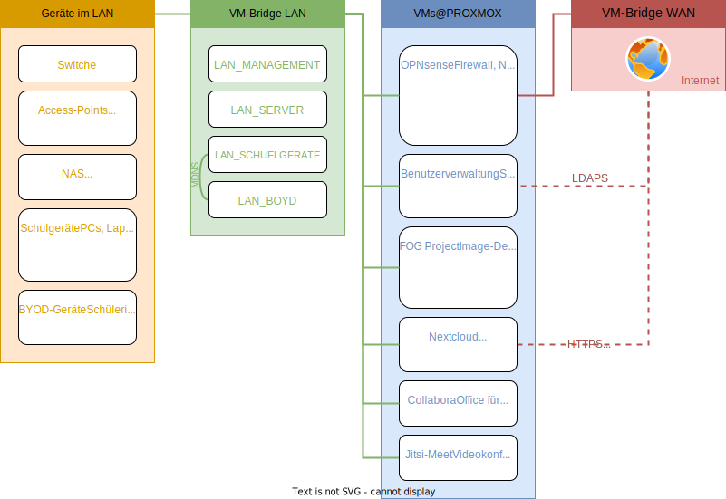

# Schulnetzkonzept

Als Systembetreuer und Informatiklehrer möchte ich meine Dokumentationen zur Realisierung von Lösungen für Schulnetzwerke mit Ihnen teilen.

## Ziele

- Umsetzung mit Hilfe gut dokumentierter und stabiler Open-Source-Anwendungen
- Datenschutzkonforme Cloud- und Kollaborationslösungen
- Effizienz und Sicherheit durch Virtualisierung
- Keine All-In-One-Lösung sondern ausgesuchte Lösungen je Aufgabe

!> Die Umsetzung des Konzepts setzt grundlegende Kentnisse in der Bedienung von Linuxsystemen mithilfe der Konspole veraus. \
Hilfreiche Links/Tools hierzu: \
[Wichtige Konsolenbefehle](https://www.shellbefehle.de/befehle) \
[Verwendung des Konsolentexteditors vim](https://devhints.io/vim) \
[Putty - SSH-Consolen-Client](https://www.putty.org) \
[WinSCP - Dateitransfer-Client](https://winscp.net)

## Skizze zum Schulnetzkonzept

## Unterstützen Sie das Schulnetzkonzept!

- [mit einem Fork des Projekts](https://github.com/mayerthomas/schulnetzkonzept)
- [mit Ihren Vorschlägen und Anregungen in Form von Issues](https://github.com/mayerthomas/schulnetzkonzept/issues)